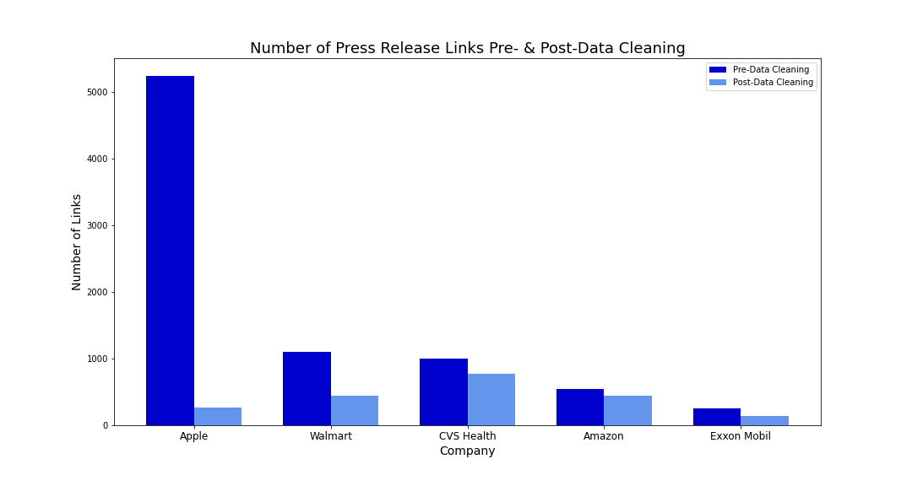
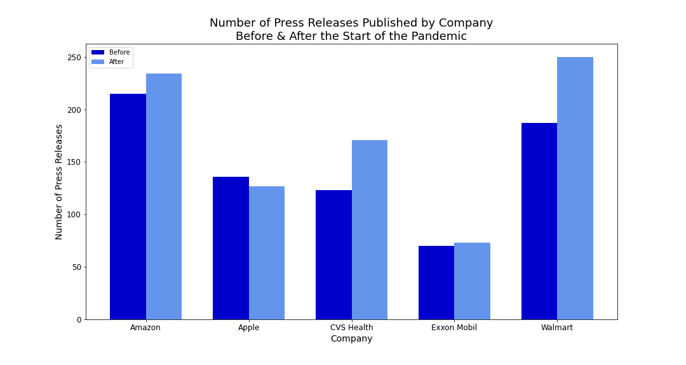
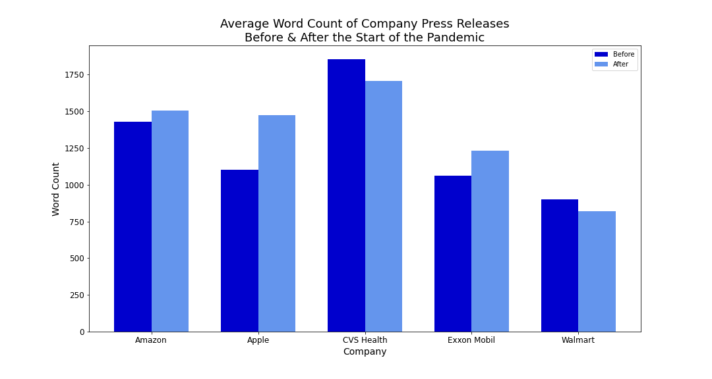
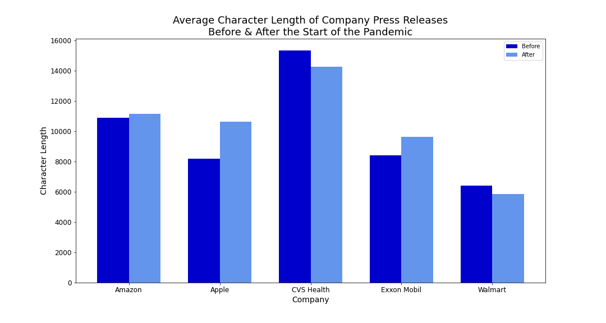
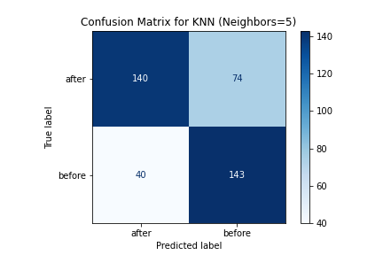
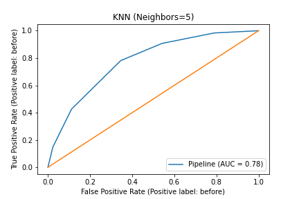

# Determining Whether Press Release Language Has Changed Since the Start of the Pandemic

## Table of Contents
* [Introduction](#Introduction)
* [Problem Statement](#Problem-Statement)
* [Data Collection & Cleaning](#Data-Collection-&-Cleaning)
* [Modeling](#Modeling)
* [Conclusion](#Conclusion)
* [Next Steps](#Next-Steps)
* [Repo Contents](#Repo-Contents)

## Introduction
Press releases play an importance role in how companies communicate with key stakeholders, such as investors, customers and media.

Since the start of the pandemic, companies have had to continue to find ways to communicate their actions with stakeholders during a time when many were unable to connect with them in person.

This project seeks to determine if press release language before and after the start of the pandemic has changed. In order to determine whether or not there is a difference in how companies speak in press releases since the start of the pandemic, this project leverages Natural Language Processing (NLP) and binary classification models to predict which time period a press release was published. 

For the purposes of this project, all press releases published before January 2020 will be categorized as `before`, while all press releases published starting January 1, 2020 until present day will be categorized as `after`. I chose January 2020 as the start date of the pandemic because, although lockdowns in the U.S. did not start until March, companies started to experience issues in their supply chains as lockdowns in China caused significant manufacturing delays. 

For this project, my baseline was 0.54, close to an even split across the two categories. Across all of the models I tested, they all performed better than the baseline, with the KNearest Neighbors (KNN) models performing the best. 

* KNN with `n_neighbors = 5` scored the best, with a score of 0.78 on the training data and a score of 0.71 on the test data. 
* KNN with `n_neighbors = 3` scored higher on the training data with a score of 0.83, but scored lower on the test data, with a score of 0.70.

## Problem Statement
Use NLP and binary classification models to determine whether or not the top five Fortune 100 companies have been changed how they communicate through press releases.

## Data Collection & Cleaning

The data collection and cleaning portion of this project occurred in six distinct phases:

### 1. Gather information from Fortune's website

First, I had to gather the most recent Fortune 100 list from Fortune's website, which included the company's name, the company's rank and the links to each company's profile page. 

Once I had the information from the Fortune 100 list, I iterated through each link and found the company's website, as listed on the company's profile page on Fortune. 

In a few instances, the link provided by Fortune was incorrect, so I manually reassigned those links.

### 2. Find the newsroom links for each company from their company page

Once I had a link for each company's main/corporate website, I scraped all of the links from the HTML on the company's homepage and used the `fuzzywuzzy` library to determine how close each link was to the words `news`, `press` and `corporate` to account for differences in how each company might refer to its newsroom page. 

From there, I was able to assess the links and create a file that contained each company's newsroom link, which was then assigned to each company in the `final` column of the dataframe.

### 3. Gather HTML from newsrooms

Once I had the newsroom url for each company, I limited the data to just the top five Fortune 100 companies, and added the `loop_url`, `type` and `page_type` columns. The categories I assigned to each of these columns were then used to iterate through multiple pages of the companies' newsrooms and collect all of the links available on each page. The HTML data was then saved into the [html](./data/html) folder.

### 4. Parse HTML from files

Following the HTML collection, I created a loop that iterated through all of the files in the [html](./data/html) folder, as well as all of the tags in each row of the file, to gather the links from each page. 

I followed this up by filtering out unnecessary links (i.e., those that don't lead to press releases)using `.str.contains()` with regular expressions, and determined whether or not the link needed a base (i.e., whether or not it had `https://....com` in front of it), and added that in to the dicitonary that contained the regular expressions, as appropriate. 

As seen in the graph below, cleaning up the links removed unnecessary links from all of the files, the most notable of which is Apple, that lost roughly 95% of the links we gathered.

Prior to cleaning the files, there were 8,147 links in total. After cleaning up the files, there are 2,059 links in total, which means that close to three-quarters (74.7%) of the links originally collected from the HTML have nothing to do with press releases. This leaves a more targeted group of links from which the press releases can be collected.

### 5. Gather press release text

Now that I had all of the links to the press releases, I started to collect the full text, titles and HTML from each press release hosted on the company's website and saved each company's full text in the [press_releases](./data/press_releases) folder.

### 6. Data cleaning

After I had collected all of the data from the press releases, I had to go through and find the dates for when each press release was published so I could assign the label for modeling. I also cleaned the data to remove mentions of the years and other key words so as to not leak the target into the model. The several of the words in the list of potential leak words that I removed from the data include: '2021', '2020', '2019', 'Covid-19', 'Covid', 'COVID-19', 'COVID', 'Coronavirus', 'coronavirus' and 'pandemic'.

The cleaned data shows that most companies have published more press releases since the start of the pandemic than they did in the year before. This makes sense, given there are two additional months in the `after` category than there are in the `before` category. The exception in this case is Apple, which has published 9 fewer press releases since January 2020 than it did in all of 2019.

Additionally, the data shows that three of the five companies have, on average, published longer press releases after the pandemic than before both by word count and by character length. Apple saw the biggest jump in both of these categories, with press releases that are, on average, 300 words and 2,400 characters longer than they were before the pandemic.

## Modeling

By using binary classification models, I can determine whether or not press release language has changed by achieving an accuracy score higher than the baseline for the data collected. The baseline for this project is 0.54.

I tested two different types of models, Logistic Regression and KNearest Neighbors, and tested different hyperparameters for each model. 

For my Logistic Regression models, I tested the models with the `penalty` set to both `l2` and `none`. For the KNearest Neighbors models, I tested the models with `n_neighbors` set to `3`, `5` and `8`. The train, test and ROC-AUC scores for each model can be found in the table at the end of this section.

Overall, the KNN model with `n_neighbors` set to 5 performed the best across train, test and ROC-AUC scores. As seen below in the confusion matrix created by the model's prediction on the test data, the model performed well on the test data, achieving an accuracy score of 0.71, well above the baseline 0.54. 

Additionally, the KNN model with `n_neighbors` set to `5` saw the highest ROC-AUC score out of the five models, with a score of almost 0.78.

|Model|Hyperparameter|Train score|Test score|ROC-AUC Score|
|-----|-----|-----|-----|-----|
|Logistic Regression|penalty: 'l2'|0.7594617325483599|0.654911838790932|0.7365813799090957|
|Logistic Regression|penalty: 'none'|0.9217830109335576|0.6952141057934509|0.7356876564016139|
|KNearest Neighbors|n_neighbors: 5|0.7821698906644239|0.7128463476070529|0.7766584954803125|
|KNearest Neighbors|n_neighbors: 8|0.7493692178301093|0.672544080604534|0.7631888054746949|
|KNearest Neighbors|n_neighbors: 3|0.8317914213624895|0.707808564231738|0.7535365915938921|

## Conclusion

Following a robust data collection and modeling process, and due to all of the models beating the baseline score, I have concluded that companies have changed the way they communicate through press releases in significant enough ways that machine learning can detect the difference.

## Next Steps

Next steps in this project could include:
* Exploring how the press release language changed between the two time periods by exploring the most-used words in each category
* Testing additional classification models to see if the model performance improves
* Using `GridSearchCV` to test more hyperparameters and determine if there are any other changes that could improve the models' performance

## Repo Contents

|Name|Type|Description|Output|
|-----|-----|-----|-----|
|[assets](./assets)|Directory|Contains visualizations used in this readme|None|
|[code](./code)|Directory|Contains all of the Jupyter Notebooks|None|
|[data](./data)|Directory|Contains csv files and directories that contain csv files|None|
|[html](./data/html)|Directory|Contains csv files with HTML scraped from websites|None|
|[links](./data/links)|Directory|Contains csv files with links parsed from the HTML contained in the html file csvs|None|
|[press_releases](./data/press_releases)|Directory|Contains csv files with the press release full text, from which the models are trained|None|
|[01-gather-data-from-fortune-website.ipynb](./code/01-gather-data-from-fortune-website.ipynb)|Jupyter Notebook|Contains code for gathering information from Fortune's website.|[fortune_100_data.csv](./data/fortune_100_data.csv)|
|[02-find-newsroom-urls.ipynb](./code/02-find-newsroom-urls.ipynb)|Jupyter Notebook|Contains code for gathering HTML from company websites to identify the matches for company newsrooms.|[fortune_100_data_w_links.csv](./data/fortune_100_data_w_links.csv)|
|[03-gather-html-from-newsrooms.ipynb](./code/03-gather-html-from-newsrooms.ipynb)|Jupyter Notebook|Contains code to loop through newsroom pages and collect all of the HTML from each page.|Updated [fortune_100_data_w_links.csv](./data/fortune_100_data_w_links.csv) file. Files in the [html](./data/html) folder.|
|[04-parse-html-from-files.ipynb](./code/04-parse-html-from-files.ipynb)|Jupyter Notebook|Contains code to parse all the HTML collected by the code in the previous notebook in order to obtain all the links from the newsrooms.||
|[05-gather-press-release-text.ipynb](./code/05-gather-press-release-text.ipynb)|Jupyter Notebook|||
|[06-clean-explore-data.ipynb](./code/06-clean-explore-data.ipynb)|Jupyter Notebook|||
|[07-NLP-modeling.ipynb](./code/07-NLP-modeling.ipynb)|Jupyter Notebook|||
|[fortune_100_data.csv](./data/fortune_100_data.csv)|.csv file|Output from [01-gather-data-from-fortune-website.ipynb](./code/01-gather-data-from-fortune-website.ipynb). Contains information gathered from Fortune's website.|None|
|[fortune_100_data_w_links.csv](./data/fortune_100_data_w_links.csv)|.csv file|Output from the culmination of [02-find-newsroom-urls.ipynb](./code/02-find-newsroom-urls.ipynb) and [03-gather-html-from-newsrooms.ipynb](./code/03-gather-html-from-newsrooms.ipynb). Contains data from Fortune website, along with additional information from each company's website.|None|